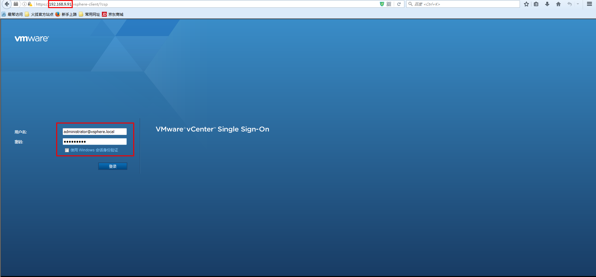
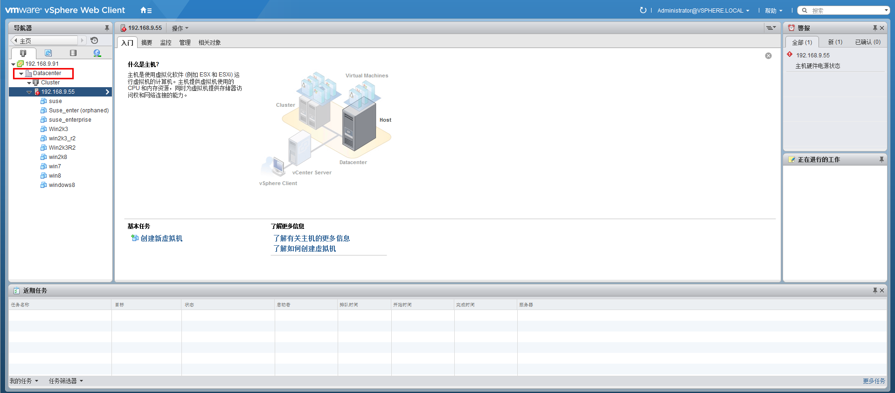

# 转换
> **注意**
> 目前，virt-v2v 不能转换 VMware 中的 Windows > 7 或 2008 R2 的虚拟机。

* 在转换 VMware 虚拟机之前，需要确保如下几点已经实现：
  1. 首先需要关闭即将被准换的虚拟机。
  2. 被转换的虚拟机没有安装 VMware Tool。
  3. ESX(i) 服务器（也就是 vSphere 中的作为主机的机器）的用户身份验证。
     ~~~ bash
     [root@64host ~]# cat ~/.netrc # 需要自己创建
     machine 192.168.9.55 login root password Eayun123! # 用户名：root | 密码：Eayun123!
     [root@64host ~]# ll ~/.netrc 
     -rw-------. 1 root root 51 6月  28 14:07 /root/.netrc # 注意权限是 0600，因为 virt-v2v 需要读取该文件。
     ~~~

* 开始转换：
  支持转换的操作系统：
  * Windows 7
  * Windows 2003 R2 / 2008 R2
  * Windows 2003 / 2008
  * CentOS
  * Suse

  > **注意**：
  > 由于当前 libvirt 还无法处理 json，所以请您在转换之前务必执行 export LIBGUESTFS_BACKEND=direct，不然会提示如下内容：
    ~~~ bash
    [zhangyaqi@localhost VMware]$ virt-v2v -v -x -ic vpx://administrator%40vsphere.local@192.168.9.91/Datacenter/192.168.9.55?no_verify=1 -o ovirt -os 192.168.2.56:/home/ply/workspace/storage/Export --network eayunosmgmt Win2k3
    virt-v2v: libguestfs 1.30.6 (x86_64)
    [   0.0] Opening the source -i libvirt -ic vpx://administrator%40vsphere.local@192.168.9.91/Datacenter/192.168.9.55?no_verify=1 Win2k3
    input_libvirt_vcenter_https: source: scheme vpx server 192.168.9.91
    virt-v2v: error: because of libvirt bug 
    https://bugzilla.redhat.com/show_bug.cgi?id=1134592 you must set this 
    environment variable:
    export LIBGUESTFS_BACKEND=direct
    and then rerun the virt-v2v command.
    ~~~

  1. Win 2003
     ~~~ bash
     # 注意: V2V 必须要在 root 下执行
     [root@localhost ~]# virt-v2v -v -x -ic vpx://administrator%40vsphere.local@192.168.9.91/Datacenter/192.168.9.55?no_verify=1 -o ovirt -os 192.168.2.56:/home/ply/workspace/storage/Export --network eayunosmgmt Win2k3
     virt-v2v: libguestfs 1.30.6 (x86_64)
     [   0.0] Opening the source -i libvirt -ic vpx://administrator%40vsphere.local@192.168.9.91/Datacenter/192.168.9.55?no_verify=1 Win2k3
     input_libvirt_vcenter_https: source: scheme vpx server 192.168.9.91
     为 administrator@vsphere.local 输入 192.168.9.91's 密码: # 输入 vSphere Web Client 的密码
     Enter host password for user 'administrator@vsphere.local': # 还要再输入一次
     ... # 漫长的执行过程，注意这里的 -v -x 是进入 debug 模式，所以输出较多。当然您也可以不加 -v -x 选项。
     ~~~

  2. Win Server 2008 R2
     ~~~ bash
     virt-v2v -v -x -ic vpx://administrator%40eayunos.com@192.168.9.77/Datacenter0/192.168.9.55?no_verify=1 -o ovirt -os 192.168.2.56:/home/ply/workspace/storage/Export --network eayunosmgmt Win2008_R2
     ~~~

  3. Win Server 2008
     ~~~ bash
     virt-v2v -v -x -ic vpx://administrator%40vsphere.local@192.168.9.91/Datacenter/192.168.9.55?no_verify=1 -o ovirt -os 192.168.2.56:/home/ply/workspace/storage/Export --network eayunosmgmt w2k8
     ~~~

  4. Win Server 2003 R2
     ~~~ bash
     virt-v2v -v -x -ic vpx://administrator%40vsphere.local@192.168.9.91/Datacenter/192.168.9.55?no_verify=1 -o ovirt -os 192.168.2.56:/home/ply/workspace/storage/Export --network eayunosmgmt win2k3_r2
     ~~~

  5. Win Server 2003
     ~~~ bash
     virt-v2v -v -x -ic vpx://administrator%40vsphere.local@192.168.9.91/Datacenter/192.168.9.55?no_verify=1 -o ovirt -os 192.168.2.56:/home/ply/workspace/storage/Export --network eayunosmgmt Win2k3
     ~~~

  6. Win 7
     ~~~ bash
     virt-v2v -v -x -ic vpx://administrator%40vsphere.local@192.168.9.91/Datacenter/192.168.9.55?no_verify=1 -o ovirt -os 192.168.2.56:/home/ply/workspace/storage/Export --network eayunosmgmt win7
     ~~~

  7. Suse
     ~~~ bash
     virt-v2v -v -x -ic vpx://administrator%40vsphere.local@192.168.9.91/Datacenter/192.168.9.55?no_verify=1 -o ovirt -os 192.168.2.56:/home/ply/workspace/storage/Export --network eayunosmgmt suse
     ~~~

  8. CentOS
     ~~~ bash
     virt-v2v -v -x -ic vpx://administrator%40eayunos.com@192.168.9.77/Datacenter0/192.168.9.55?no_verify=1 -o ovirt -os 192.168.2.56:/home/ply/workspace/storage/Export --network eayunosmgmt CentOS7
     ~~~

* 参数说明：
  * `-v(--verbose)`：可以看到 bebug 的信息。
  * `-x`：追踪 libguestfs API 调用。
  * `-ic libvirtURI`：为读取虚拟机，指定 libvirt 连接 URI。
  * `libvirtURI` 格式：vpx://user@server/Datacenter/esxi
    * `user`：登录 `vSphere Web Client` 的用户名，如图：

      
     
      由于我的用户名是 `administrator@vsphere`，而 `@` 字符在 URI 中有其他含义，所以将 `@` 字符替换为 `%40`。
    * `server`：`vSphere Web Client` 的 ip 地址。
    * `Datacenter`：指虚拟机所在的数据中心的名称，如图：

      
    * `esxi`：ESX(i) 服务器 ip 地址。
    * `?no_verify=1`：禁用证书检查。
  * '-o ovirt'：设置输出方法为 ovirt。
  * '-os'：在该参数的后面指明导出域的地址，该导出域必须是初始化过的（即曾被添加到 EayunOS 管理平台上过）。
  * '--network'：在该参数后面指明您的 EayunOS 管理平台的虚拟网络名称。
  * 最后一个参数是虚拟机的名称。
