# 创建 virt-manager 虚拟机
1. 安装 virt-manager
   ~~~ bash
   dnf -y install virt-manager
   ~~~

2. 打开 `虚拟系统管理器`
   

3. 准备一台作为 node 的机器
   ~~~ bash
   [zhangyaqi@localhost ~]$ ssh root@192.168.2.56
   root@192.168.2.56's password: 
   Last login: Mon Jun 20 14:53:05 2016 from 192.168.255.200
   [root@hyper56 ~]# uname -r
   2.6.32-504.30.3.el6.x86_64
   # 确保已经安装并开启了 libvirt
   [root@hyper56 yum.repos.d]# rpm -qa | grep libvirt
   libvirt-client-0.10.2-46.el6_6.6.x86_64
   libvirt-0.10.2-46.el6_6.6.x86_64
   [root@hyper56 yum.repos.d]# service libvirtd status
   libvirtd (pid  7099) is running...
   ~~~

4. 在 node 上创建一个 libvirt 用户
   ~~~ bash
   [root@hyper56 ~]# saslpasswd2 -a libvirt admin # 用户名：admin
   Password: 
   Again (for verification): 
   ~~~

5. 添加连接
   1. 点击【文件】，选择【添加连接】。
   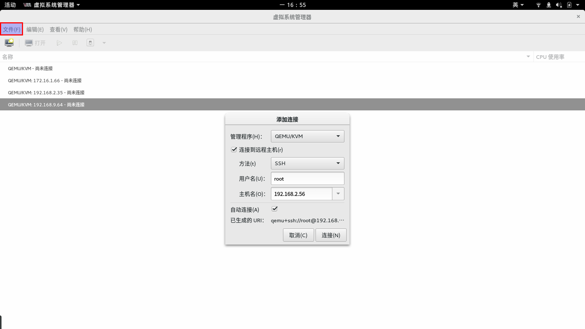
   输入 `root` 密码后，连接成功！点击【文件】，选择【新建虚拟机】。
   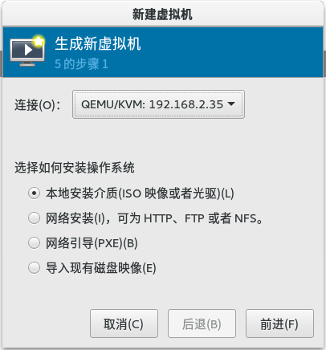

6. 新建虚拟机
   1. 【选择如何安装操作系统】—— 这里我选择的是【本地安装介质】
   2.  
      
      选择本地的 ISO 镜像。
   3. 我的 ISO 文件放在 `/home/virt-manager` 了目录中。

      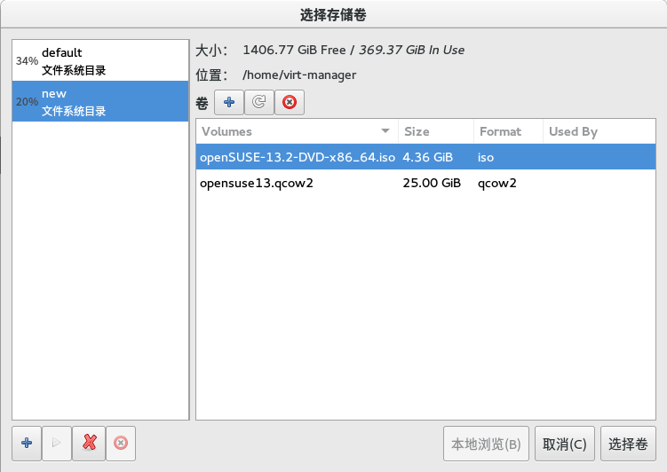

      点击【选择卷】按钮。 
   4. 选择相应的操作系统类型和版本

      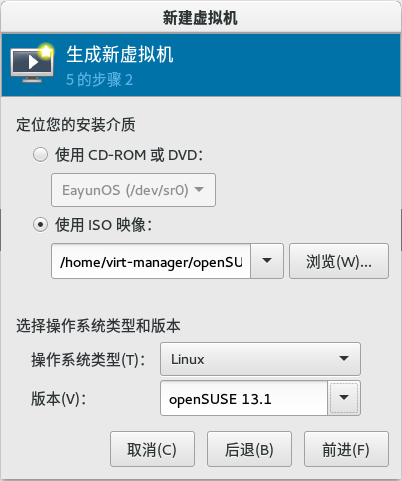
   5. 设置内存和虚拟 CPU 个数

      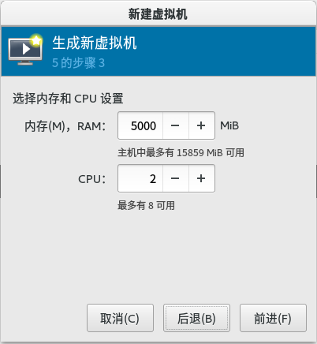
   6. 选择存储，这里我选择第二个选项【选择管理的或者其它现有存储】

      
      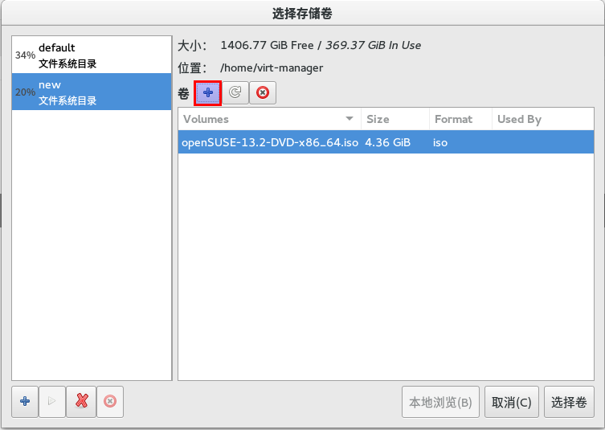
      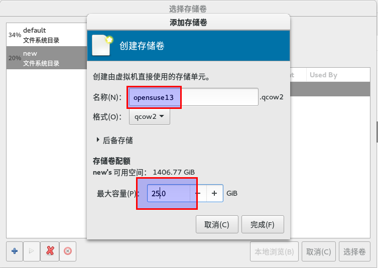
      

      点击【选择卷】按钮。

      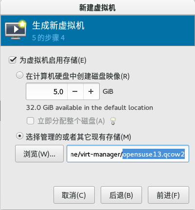
      
      点击【前进】按钮。
      
      > **重要**
      > 为新建的磁盘添加写权限
        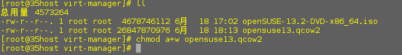
   7. 选择网络

      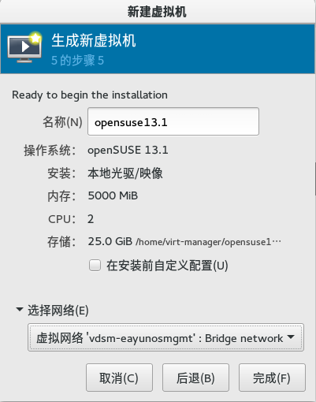

      点击【完成】按钮。

7. 开启虚拟机
   0. 完成后，点击【打开】按钮，在工具栏中几点【查看】，选择【详情】。
   1. 修改【引导选项】
      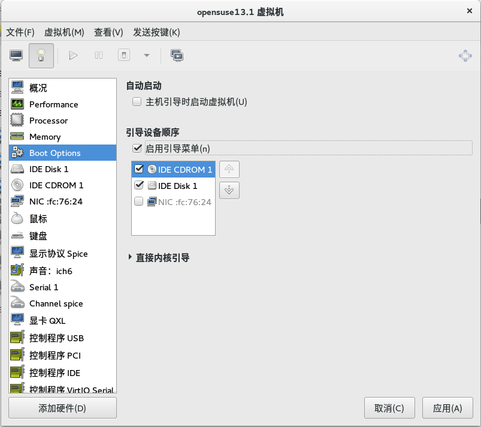
   2. 修改【显示协议】
      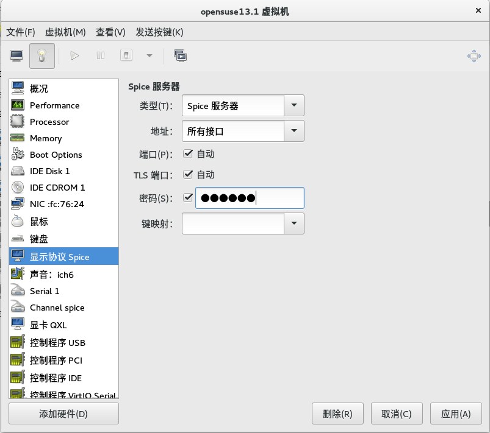

   3. 将【查看】的内从切换为【控制台】，并点击打开按钮。
